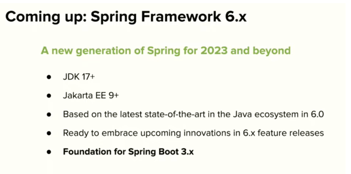

# 머릿글

[원문](https://medium.com/@zarinfam/what-happened-at-spring-i-o-2022-conference-spring-boot-3-is-coming-1382d46fd4a1)을 번역한 글입니다.

약간의 의역이 첨부되어 있습니다.

## 원문
Spring I/O 2022 컨퍼런스는 나에게 매우 휼륭했는데, 2년 전 이후로 처음으로 오프라인 이벤트 였기 때문이다. 나는 2022/05/26 ~ 27 까지 열리는 이 환상적인 컨퍼런스에 참석했다. (소개글은 생략하겠습니다..)

### Open ceremony and Keynote

오픈 세레모니와 연설을 마친뒤에 Juergen Hoeller 는 SpringBoot 3 과 Spring Framework 6 에 관해 중요한 말을 했다. 
Juergen 은 Spring Framework6 는 향후 10년간 스프링 프레임 워크의 새로운 세대라고 말했다. (제대로 번역을 못한것 같은 느낌..)
내가 생각하기에 Spring Framework6 에서의 가장 중요한 발표는 JDK 17+ 기반의 프레임워크의 증가와, GraalVM Native 에서 AOT 를 실행할 수 있도록 지원해주는 것이였다.

Spring Framework6 는 2022 년 11 월에 릴리즈될 예정이다.

만약 키노트와 오픈 세레모니를 보고 싶다면 아래 영상을 시청하면 된다.

[영상 링크](https://www.youtube.com/watch?v=3xjjXq4EEx4)

### Conference sessions

스케쥴에 따르면 매일 정해진 시간에 동시에 3 ~ 4 개의 다른 방에서 각기 다른 프레젠테이션 발표가 이뤄져서, 당신이 원하는 프레젠테이션 한가지를 선택하여 참석할 수 있었다.
흥미 진진한 Presentation 이 많았고, 다가 오는 주차에 [Spring I/O youtube channel](https://www.youtube.com/channel/UCLMPXsvSrhNPN3i9h-u8PYg) 에 흥미로운 프레젠테이션이 업로드 될 것이다.
당신은 playlist 에서 이것을 볼 수 있다.

모든 영상들 중에서, `Bootiful Kubernetes Operators by Cora Iberkleid and Josh Long` 은 나머지 것보다 더 내게 매력적으로 느껴졌다. 이 휼륭한 발표에서 Spring Boot 로 Kubernetes Controller 를 작성하고, GraalVM 과 Spring Native
를 이용하여 이를 native 하게 컴파일하고, 마지막으로 이것들을 쿠버네티스에 설치하는 것을 보여준다. 운 좋게도 이 발표는 아래 링크에서 확인할 수 있다.

[영상 링크](https://youtu.be/5IROOj7sLKg)

## 알게 된 단어

- in-person event : **오프라인 이벤트** (내 생각엔 코로나때 온라인으로 하다가 오프라인 행사를 열어서 이 단어를 사용한 것 같았다.)
- Of all of them : **모든 것들 중에서**